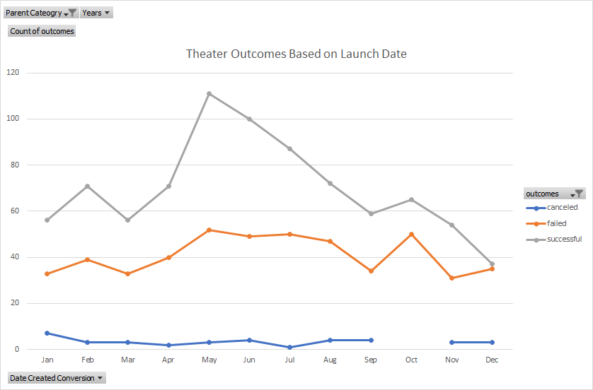

# Kickstarter Analysis with Excel

## Overview of Project

The Purpose of this analysis was to determine the number of outcomes (Successful, failed, canceled) in launching a Kickstarter. 

The first analysis "Outcomes Based on Launch Date" was to generate the number of Theater (Parent Category) outcomes (Successful, failed, canceled) based on Launch Date (Month). 

The second analysis "Outcomes Based on Goals" was to generate the number of Plays (Subcategory) outcomes (Successful, failed, canceled) based on the Kicstarter Goal Cost ($).

## Analysis and Challenges

### Analysis of Outcomes Based on Launch Date
To perform this analysis using the raw excel data, the "Category and Subcategory" column must be split into "Parent Category" and "Subcategory" using the "Data tab"/"Text to Columns"/"Delimiter" function. This will separate the contents in one column into two columns.

Next, a new column (S) will be created with the header "Date Created Conversion". The following formula is added in this column:

This will generate the converted Launch Date from the Unix timestamp.

Then, a new column (U) will be created with the header "Year". The Year () function is used to extract the year from the "Date Created Conversion" column.

To create a Pivot Chart, the whole worksheet is selected. In the new sheet, the Pivot Table and Pivot Chart will be empty. 

Place the following headers into the fields. This will create Pivot Table and Pivot Chart.

Make sure to filter the Parent Category to "Theater" and Outcomes to "Successful, failed, canceled). In addition, the Months should also be filtered from Lowest to Highest. The graph is generated below:

### Analysis of Outcomes Based on Goals
To perform this analysis, a new worksheet will need to generated with 8 different columns. They are titled as "Goal, Number Successful, Number Failed, Number Canceled, Total Project, Percentage Successful, Percentage Failed, Percentage Canceled"

In the goal column, the Goal $ amount are broken up into dollar-amount ranges. They are broken up 12 rows as defined below:

In this analysis, the "Countifs()" function is used to filter the "Outcomes", "Goals", and "Subcategory" fields. Below is an example of the code.

Before generating the line graph, the last three columns "Percentage Successful", "Percentage Failed", and "Percentage Canceled" have values created by dividing the Outcomes (Successful, Failed, Canceled) by the Total Projects. Remember to click "Percentage" for the cell tab.

A line graph is generated by using the data created from the table. Remember to filter out "Number of Successful, Number Failed, and Number Canceled" from the Series tab. The line graph can be found below:

### Challenges and Difficulties Encountered

For the Outcomes Based on Launch Date Analysis, I did not encounter any challenges. However, a potential challenge is forgetting to filter to the specific Category or Outcomes that you're trying to analyze.

For the Outcomes Based on Goals Analysis, I ran to a few challenges. One challenge was forgetting to add the filter to "plays" under the "Subcategory" fields". Another challenge while using the "Countifs()" function is missing the either the upper range or lower range of the dollar-amount in the function. 

## Results

- What are two conclusions you can draw about the Outcomes based on Launch Date?

Based on the Outcomes Based on Launch Date Graph, there are more successful Theater Kickstarters if they are launched in the month of May/June/July, indicating that Launch Date for Theater Kickstarters are more popular in the Summer months. In addtion, the number of successful and failed Theater Kickstarters are almost equal in the month of December, indicating that Launching in December is not a popular month.

- What can you conclude about the Outcomes based on Goals?

Based on the Outcomes based on Goals graph, Plays Kickstarters have a high percentage of failing or low percentage of being successful if the goal amount is $45000 or greater. This indicate that if the goal cost is too high, there is a high change that the Play Kickstarter will fail. In addition, both the Percentage Successful and Percantage Failed are almost inversely proportional. This indicate if Percentage Failed is high, Percentage Successful will be low and if Percentage Failed is low, then Percentage Successful will be high. This occurs because no Plays Kickstarters were canceled, "Percentage Canceled" is zero.

- What are some limitations of this dataset?

The limitation of this dataset is creating predictions and writing a story for Kickstarters that were canceled. For example, the number of outcomes for "Canceled" were so low in the Theaters category that it's hard to predict which month impacts Kickstarters that are canceled. In addition, there were no "Canceled" Kickstarters in the Play subcategory regardless of Goal price.

- What are some other possible tables and/or graphs that we could create?

A recommendation to combat the limitation is to create "Outcomes Based on Launch Date" and "Outcomes Based on Goals" with no filter on Category or Subcategory. This will determine if Kickstarters as a whole are canceled based on Launch Date or Goals.

